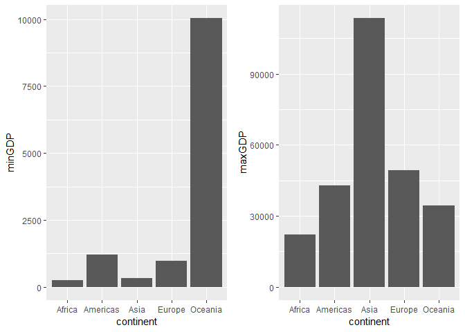
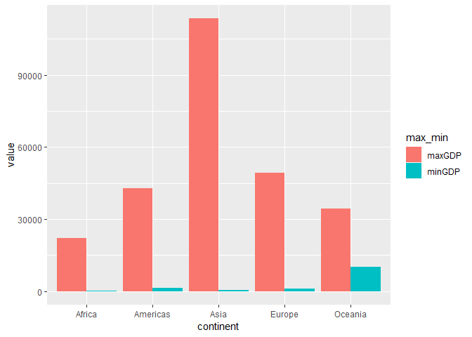
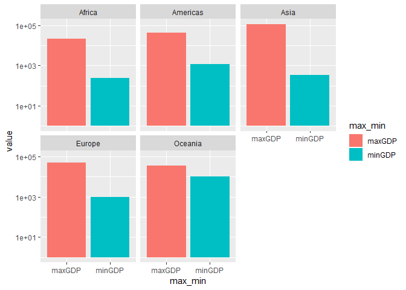
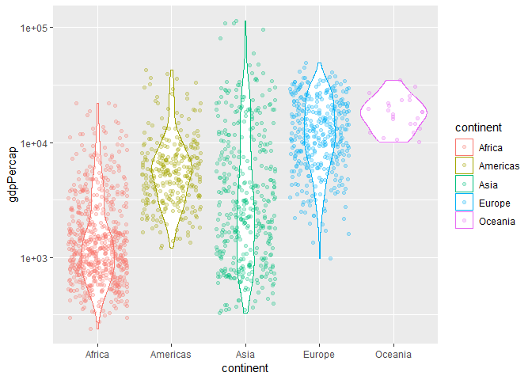
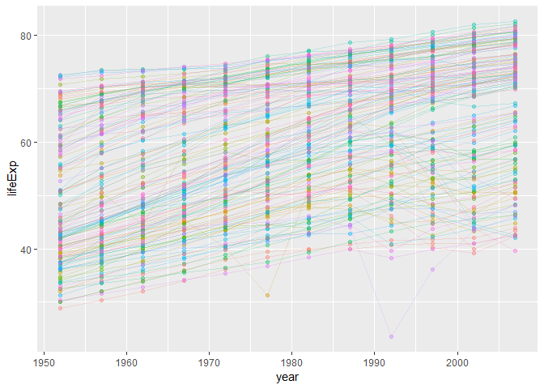
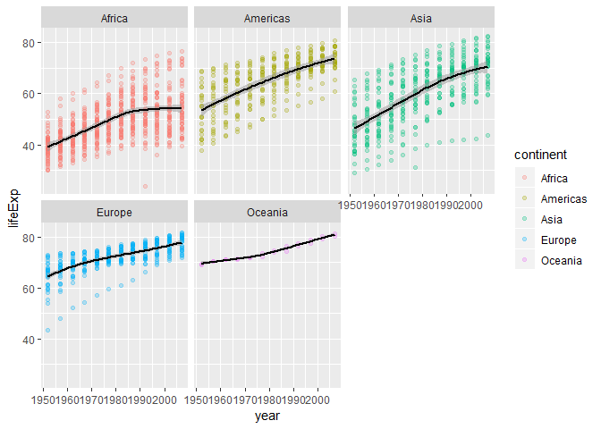

hw03
================

  - [Introduction](#introduction)
      - [Load packages](#load-packages)
  - [Get the maximum and minimum of GDP per capita for all
    continents](#Get%20the%20maximum%20and%20minimum%20of%20GDP%20per%20capita%20for%20all%20continents)
  - [Alternative Means](#Alternative-Means)

# Introduction

The purpose of this assignment is to explore the `gapminder` dataset
using `dplyr` and `ggplot2` packages in `R`.

## Load packages

``` r
library(gapminder)
library(tidyverse)
library(knitr)
library(gridExtra) #used to put plots side by side
```

## Get the maximum and minimum of GDP per capita for all continents

We can find the overall maximum and minimum using the `range` function:

``` r
range(gapminder$gdpPercap)
```

    ## [1]    241.1659 113523.1329

However if we want to find the maximum and minimum for each individual
country, we would need to do the following:

``` r
gdp_maxmin = gapminder %>% 
  group_by(continent) %>% 
  summarize(minGDP = min(gdpPercap),maxGDP=max(gdpPercap))
gdp_maxmin %>% 
  kable()
```

| continent |     minGDP |    maxGDP |
| :-------- | ---------: | --------: |
| Africa    |   241.1659 |  21951.21 |
| Americas  |  1201.6372 |  42951.65 |
| Asia      |   331.0000 | 113523.13 |
| Europe    |   973.5332 |  49357.19 |
| Oceania   | 10039.5956 |  34435.37 |

We can look at this table in a bar graph:

``` r
min_plot = gdp_maxmin %>% 
  ggplot(aes(x=continent,y=minGDP)) +
  geom_col()
max_plot = gdp_maxmin %>% 
  ggplot(aes(x=continent,y=maxGDP)) +
  geom_col()

grid.arrange(min_plot,max_plot, ncol=2)
```

<!-- -->

Since we plotted the maximum and minimum separately, the plots are done
using different scales. It would then be useful to plot the minimum and
the maximum in one bar plot so we can see them together with the same
scale. To do this, we must first combine `maxGDP` and `minGDP` into one
column, then we can use `ggplot` to make the plot:

``` r
gathered_gdp_maxmin = gdp_maxmin %>%
  gather(key="max_min",value="value",maxGDP,minGDP)

gathered_gdp_maxmin %>% 
  ggplot(aes(x=continent,y=value))+
  geom_col(aes(fill=max_min),position="dodge")
```

<!-- -->

We can also use facet to make individual plots for the continents. From
the above plot, we see that there is a big difference between the max
and min, so we will use a log scale for this plot.

``` r
gathered_gdp_maxmin %>% 
  ggplot(aes(x=max_min,y=value)) +
  scale_y_log10() +
  geom_col(position="dodge",aes(fill=max_min)) +
  facet_wrap(~continent)
```

<!-- -->

To get a better idea of the distribution of the GDP per capita for each
continent, we will make a jitter plot superimposed on a violin plot:

``` r
gapminder %>% 
  ggplot(aes(x=continent,y=gdpPercap)) +
  scale_y_log10() +
  geom_violin(aes(colour=continent)) + 
  geom_jitter(aes(colour=continent),alpha=0.25)
```

<!-- -->

# Alternative Means

Before we calculate alternative means, let’s first look at a plot of the
life expectancies by year:

``` r
gapminder %>% 
  group_by(country) %>% 
  ggplot(aes(x=year,y=lifeExp)) +
  geom_point(aes(colour=country),show.legend=FALSE,alpha=0.35)+
  geom_line(aes(group=country,colour=country),show.legend=FALSE,alpha=0.2)
```

<!-- -->

This plot doesn’t tell us too much, but it gives us an idea of what the
data looks like. We notice that apart from a few exceptions, the general
trend is that life expectancy is increasing overall.

If would be more helpful if we visualize the change in the mean life
expectancy per continent. We can fit the trend on the plot as well:

``` r
gapminder %>% 
  ggplot(aes(year,lifeExp,colour=continent)) + 
  facet_wrap(~continent) +
  geom_point(alpha=0.25) +
  geom_smooth(colour='black',alpha=0.5)
```

    ## `geom_smooth()` using method = 'loess' and formula 'y ~ x'

<!-- -->

We can find find the mean life expectancy for each country. It is a long
table, so we only show the first 10 countries.

``` r
country_mean = gapminder %>% 
  group_by(continent,country) %>% 
  summarize(m=mean(lifeExp))

country_mean %>% 
  head(10) %>% 
  kable()
```

| continent | country                  |        m |
| :-------- | :----------------------- | -------: |
| Africa    | Algeria                  | 59.03017 |
| Africa    | Angola                   | 37.88350 |
| Africa    | Benin                    | 48.77992 |
| Africa    | Botswana                 | 54.59750 |
| Africa    | Burkina Faso             | 44.69400 |
| Africa    | Burundi                  | 44.81733 |
| Africa    | Cameroon                 | 48.12850 |
| Africa    | Central African Republic | 43.86692 |
| Africa    | Chad                     | 46.77358 |
| Africa    | Comoros                  | 52.38175 |

We can calculate a 10% trimmed mean for each year as follows:

``` r
trimmed = gapminder %>% 
  group_by(year,continent) %>% 
  summarize(trimmed_mean = mean(lifeExp,trim=0.1))

trimmed %>% kable()
```

| year | continent | trimmed\_mean |
| ---: | :-------- | ------------: |
| 1952 | Africa    |      38.93298 |
| 1952 | Americas  |      53.18157 |
| 1952 | Asia      |      45.98107 |
| 1952 | Europe    |      65.09708 |
| 1952 | Oceania   |      69.25500 |
| 1957 | Africa    |      40.96993 |
| 1957 | Americas  |      56.04624 |
| 1957 | Asia      |      49.16422 |
| 1957 | Europe    |      67.30763 |
| 1957 | Oceania   |      70.29500 |
| 1962 | Africa    |      43.04819 |
| 1962 | Americas  |      58.64005 |
| 1962 | Asia      |      51.45357 |
| 1962 | Europe    |      69.07921 |
| 1962 | Oceania   |      71.08500 |
| 1967 | Africa    |      45.11750 |
| 1967 | Americas  |      60.75086 |
| 1967 | Asia      |      54.78682 |
| 1967 | Europe    |      70.19675 |
| 1967 | Oceania   |      71.31000 |
| 1972 | Africa    |      47.26495 |
| 1972 | Americas  |      62.86081 |
| 1972 | Asia      |      57.71233 |
| 1972 | Europe    |      71.14942 |
| 1972 | Oceania   |      71.91000 |
| 1977 | Africa    |      49.34983 |
| 1977 | Americas  |      64.86633 |
| 1977 | Asia      |      60.41761 |
| 1977 | Europe    |      72.22067 |
| 1977 | Oceania   |      72.85500 |
| 1982 | Africa    |      51.31998 |
| 1982 | Americas  |      66.66624 |
| 1982 | Asia      |      62.99337 |
| 1982 | Europe    |      73.09983 |
| 1982 | Oceania   |      74.29000 |
| 1987 | Africa    |      53.00740 |
| 1987 | Americas  |      68.54767 |
| 1987 | Asia      |      65.31263 |
| 1987 | Europe    |      73.96738 |
| 1987 | Oceania   |      75.32000 |
| 1992 | Africa    |      53.71045 |
| 1992 | Americas  |      70.00586 |
| 1992 | Asia      |      66.99396 |
| 1992 | Europe    |      74.73196 |
| 1992 | Oceania   |      76.94500 |
| 1997 | Africa    |      53.08371 |
| 1997 | Americas  |      71.62719 |
| 1997 | Asia      |      68.49633 |
| 1997 | Europe    |      75.77375 |
| 1997 | Oceania   |      78.19000 |
| 2002 | Africa    |      52.47467 |
| 2002 | Americas  |      72.88752 |
| 2002 | Asia      |      69.83704 |
| 2002 | Europe    |      76.88962 |
| 2002 | Oceania   |      79.74000 |
| 2007 | Africa    |      54.07752 |
| 2007 | Americas  |      74.01419 |
| 2007 | Asia      |      71.31067 |
| 2007 | Europe    |      77.82504 |
| 2007 | Oceania   |      80.71950 |

We can find weighted mean of life expectancy with population as the
weight. For this, we will only look at the population for the year 2002.
Again, we only look at the first 10 results.

``` r
gapminder %>% 
  filter(year==2002) %>% 
  group_by(country) %>% 
  mutate(weightedlifeExp = pop*lifeExp) %>% 
  summarize(mean=mean(lifeExp),
            mean.weighted= mean(weightedlifeExp)/mean(pop)) %>% 
  head(10) %>% 
  kable()
```

| country     |   mean | mean.weighted |
| :---------- | -----: | ------------: |
| Afghanistan | 42.129 |        42.129 |
| Albania     | 75.651 |        75.651 |
| Algeria     | 70.994 |        70.994 |
| Angola      | 41.003 |        41.003 |
| Argentina   | 74.340 |        74.340 |
| Australia   | 80.370 |        80.370 |
| Austria     | 78.980 |        78.980 |
| Bahrain     | 74.795 |        74.795 |
| Bangladesh  | 62.013 |        62.013 |
| Belgium     | 78.320 |        78.320 |

This does not seem to make a significant difference, most likely due to
the fact that total population is too high compared to the population of
any indiviaul country. The difference is more noticable if we look at
the continent:

``` r
gapminder %>% 
  filter(year==2002) %>% 
  group_by(continent) %>% 
  mutate(weightedlifeExp = pop*lifeExp) %>% 
  summarize(mean=mean(lifeExp),
            mean.weighted = mean(weightedlifeExp)/mean(pop)) %>% 
  head() %>% 
  kable()
```

| continent |     mean | mean.weighted |
| :-------- | -------: | ------------: |
| Africa    | 53.32523 |      53.30314 |
| Americas  | 72.42204 |      74.24736 |
| Asia      | 69.23388 |      68.13732 |
| Europe    | 76.70060 |      77.02232 |
| Oceania   | 79.74000 |      80.16006 |
